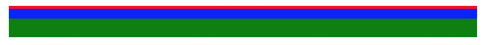

Linear Gradientだけでドット絵が作れることがわかったので作った
https://linear-gradient-qr-code.netlify.com/

https://github.com/terrierscript/example-linear-gradient-qr-code

## 解説

CSSのGradientには、同色を途中で切り替えると二色を切り分けるという可愛い特徴がある

export const Dotted1 = styled.div`
  background: linear-gradient(red, red 0 10%, blue 10% 40%, green 40% 100%);
  height: 2em;
`

<Dotted1 />



例えばこれを90degにすれば横並びになる

```jsx
export const Dotted = styled.div`
  background: linear-gradient(90deg, red, red 0 10%, blue 10% 40%, green 40% 100%);
  height: 2em;
`
```


で、これを白黒で並べればpixelになる


なお、コードは長くなるし容量の少なさを考えればbase64だしスケールしたときの綺麗さをみればCSS Gridでやったほうが良いので強盗に「linear-gradientだけで作れ」って脅されたとき以外に使い所は無い